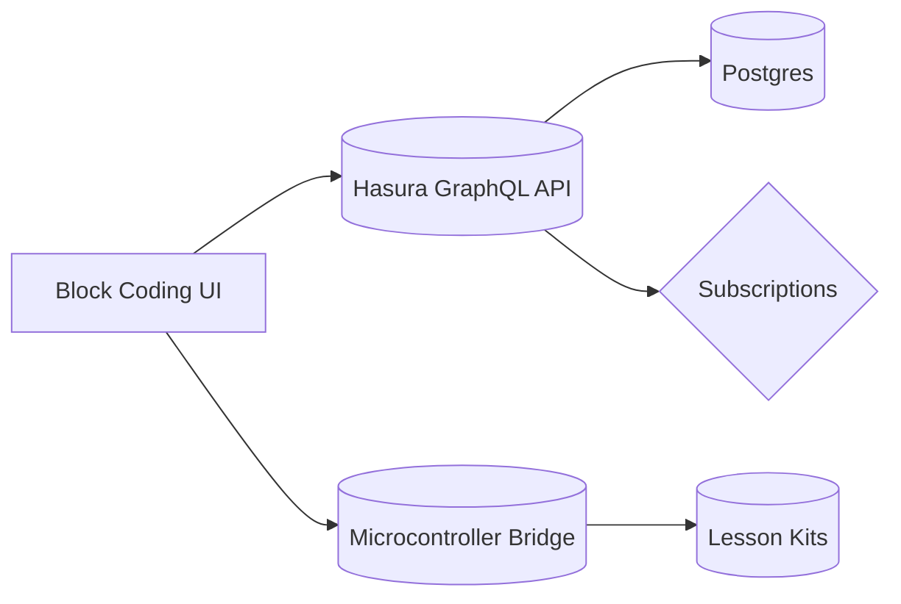

## Bringing STEM to Life

K–12 educators needed a customizable environment where students could prototype ideas quickly. I delivered a hybrid platform that mixes hardware, software, and lesson plans to make STEM approachable for every learning style.

## Platform Components

- **Block-based coding editor** with scaffolding for microcontrollers and robotics  
- **3D-printed kits** that snap together, removing the intimidation factor for first-time builders  
- Real-time classroom dashboards so teachers can monitor progress and surface teachable moments  
- Extensive documentation and tutorial videos to empower educators without a technical background

### Architecture Snapshot

## Impact

The rollout improved classroom participation and gave administrators confidence to expand the program district-wide. The toolkit now serves as a flagship example of how I translate emerging technology trends into tangible, student-friendly experiences.
